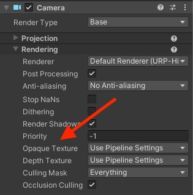
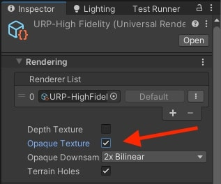
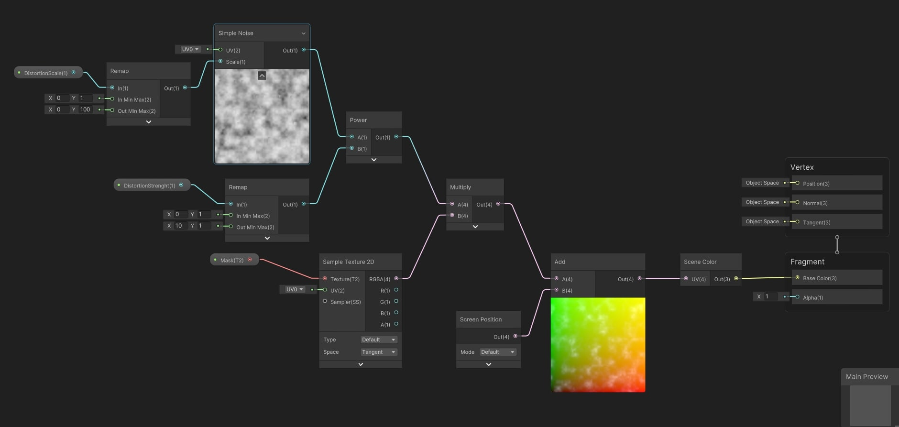
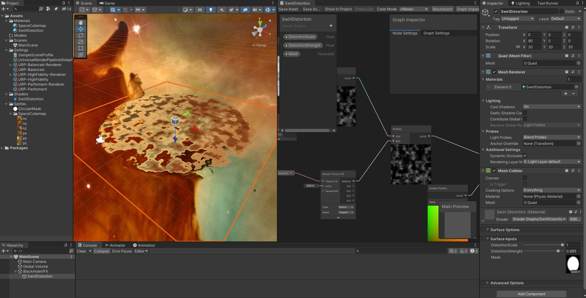
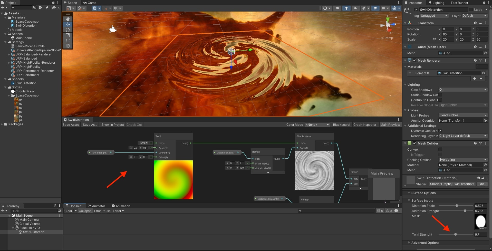

# Black Hole VFX

Implemented with Shader Graph, Shuriken Particle System and VFX Graph for the URP in **Unity 2021.3.10f1**

## Screenshots

### Table of Content

- [Implementation](#implementation)
  - [Twirl Distortion](#twirl-distortion)
  - [Fresnel Sphere](#fresnel-sphere)
  - [Twirl Texture](#twirl-texture)
  - [Twirl Particle System](#twirl-particle-system)
  - [Rotating Particles VFX Graph](#rotating-particles-vfx-graph)

### References

- [Black Hole VFX tutorial by Gabriel Aguiar](https://www.youtube.com/watch?v=FlE8e1JwVzs)
- [Space Texture](https://unsplash.com/photos/-hI5dX2ObAs)
- [CubeMap Generator](https://jonaszeitler.se/cubemap-toastmap-generator/)

## Implementation

### Twirl Distortion

- Make sure the **Camera** is using an **Opaque Color Texture**, it can also need to be configured in the **Scriptable Render Pipeline Asset**.
- This makes the **Camera** to write the current **Color Buffer** into a texture that can later be accessed by the Shaders.

- Use the **Screen Color** to access the **Color Buffer** of the **Camera**, similar to what **Grab Pass** would do in a custom shader using **Shader Lab**.
- Use the **Screen Position** to sample this texture and obtain the corresponding color pixel in it.
- If left unchanged, this results in a perfectly transparent object, if we distort these coordinates, we generate the distortion effect.
- Use a **Noise** Node to generate a texture that can be added to the Screen Position coordinates to distort them.
- **Remap** the value 0,1 to 0,100 to parametrize the scale of the Noise Texture.
- **Remap** the value 0,1 to 15,1 to parametrize the power of the Noise Texture.
- **Multiply** the Noise texture by a **Mask Texture**, to restrain the distortion to a circular shape (or any other desired shape).
- **Add** this **Noise** to the **Screen Position**, to displace and distort the **Screen Color**.

- Use a **Twirl** Node to distort the UV coordinates used to generate the Noise Texture.

### Fresnel Sphere

### Twirl Texture

### Twirl Particle System

### Rotating Particles VFX Graph
