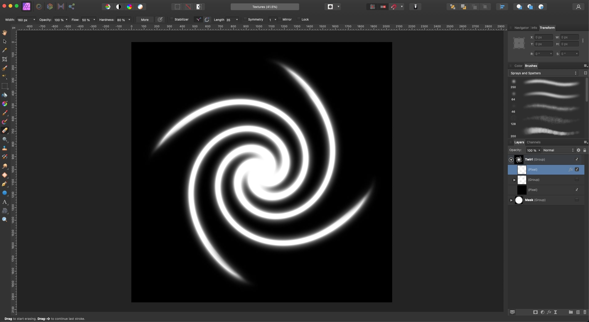

# Black Hole VFX

Implemented with Shader Graph, Shuriken Particle System and VFX Graph for the URP in **Unity 2021.3.10f1**

## Screenshots

### Table of Content

- [Implementation](#implementation)
  - [Twirl Distortion](#twirl-distortion)
  - [Fresnel Sphere](#fresnel-sphere)
  - [Twirl Texture](#twirl-texture)
  - [Twirl Particle System](#twirl-particle-system)
  - [Rotating Particles VFX Graph](#rotating-particles-vfx-graph)

### References

- [Black Hole VFX tutorial by Gabriel Aguiar](https://www.youtube.com/watch?v=FlE8e1JwVzs)
- [Space Texture](https://unsplash.com/photos/-hI5dX2ObAs)
- [CubeMap Generator](https://jonaszeitler.se/cubemap-toastmap-generator/)

## Implementation

### Twirl Distortion

- Make sure the **Camera** is using an **Opaque Color Texture**, it can also need to be configured in the **Scriptable Render Pipeline Asset**.
- This makes the **Camera** to write the current **Color Buffer** into a texture that can later be accessed by the Shaders.

- Use the **Screen Color** to access the **Color Buffer** of the **Camera**, similar to what **Grab Pass** would do in a custom shader using **Shader Lab**.
- Use the **Screen Position** to sample this texture and obtain the corresponding color pixel in it.
- If left unchanged, this results in a perfectly transparent object, if we distort these coordinates, we generate the distortion effect.
- Use a **Noise** Node to generate a texture that can be added to the Screen Position coordinates to distort them.
- **Remap** the value 0,1 to 0,100 to parametrize the scale of the Noise Texture.
- **Remap** the value 0,1 to 15,1 to parametrize the power of the Noise Texture.
- **Multiply** the Noise texture by a **Mask Texture**, to restrain the distortion to a circular shape (or any other desired shape).
- **Add** this **Noise** to the **Screen Position**, to displace and distort the **Screen Color**.

- Use a **Twirl** Node to distort the UV coordinates used to generate the Noise Texture.

- Use a **Rotation** Node to rotate the Twirl transformation of the UVs.
- Use the **Time** multiplied by a **Velocity** parameter to animate the Twirl distortion over time.

### Fresnel Sphere

- Create a simple **Fresnel** effect and parametrize the **power**.
- Parametrize the **color** in **HDR** mode, so we can set intensity and generate a **Glow** effect with the **Bloom** post processing.

### Twirl Texture

- Draw two lines with glow effect, and use the **twirl filter** in **Affinity** **Photo** to distort them.

### Twirl Particle System

- Add a **Shuriken** **Particle System** object.
- Create a **Material** for the Particles using the **Universal Render Pipeline/Particles/Unlit** Shader.
- Set some **Emission** color with **HDR** intensity, so that the Post Processing generates **Glow** out of it with the **Bloom** effect.
- Set the **Particle System** to burst individual particles using the twirl texture.
- Make the particles **fade in** with **Color over Lifetime**.
- Make the particles **rotate** with **Rotation over Lifetime**.
- Make the particles spawn with random rotation and size, between two given numbers.

### Rotating Particles VFX Graph

- Install the **Visual Effects Graph** package.

- Increase the total **capacity** and **spawn rate** of the VFX.
- Set an **initial size** randomly between two values.

- Configure the **ouput particle quad** renderer to use the **default particle texture**.
- Make the **blend** mode **additive**.
- Set the **color over life** to **fade in** and **out**.

- Set the **size over life** for particles in the update particle section.

- Initialize the **position** of the particles in a sphere shape.

- Make the particles **conform to a sphere**, to simulate the attraction of the black hole gravity.

- Make the particles initialize in a **disc shape**, by setting the position again, using the current position for X and Z axises, but setting Y to a random range.

- **Rotate** the particles along the Y axis during update.

- Set the **intensity** of the **HDR** color of the particles, to generate **Glow** through the **Bloom** post processing effect.

